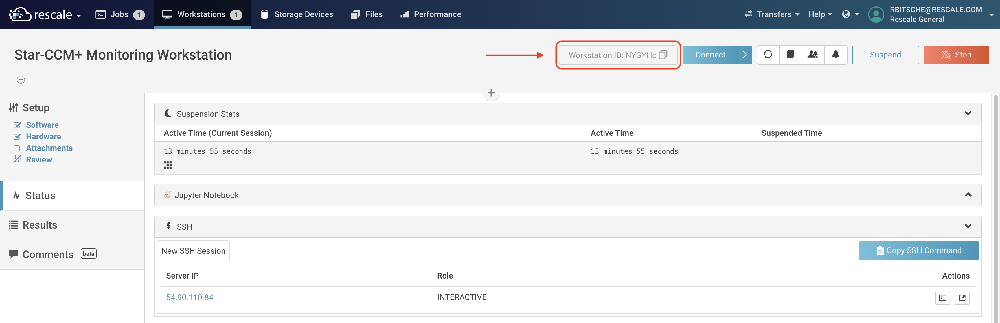

# Tunnel Maker

Maintainer: [Robert Bitsche](mailto:rbitsche@rescale.com)

## Introduction

This program facilitates the creation of an SSH tunnel between Rescale jobs or Workstations.  
It creates a temporary SSH keypair, uploads the temporary private key to job 1 
(defined using command line option `--job1`), and adds the temporary public key to `~/.ssh/authorized_keys` 
on job 2 (defined using `--job2`). 
It then creates the shell script `~/create_ssh_tunnel.sh` on job 1, that can be used to 
create an SSH tunnel from job 1 to job 2.

***
**Please note the API endpoint this script uses to identify host, user and SSH port of a job 
is not officially supported by Rescale.**
***

## A Note on Security

Please note that the private temporary SSH key created by the `tunnel_maker.py` script is uploaded to job 1. 
Users who get access to this job - for example because the job was shared with them - can use the private 
temporary SSH key to log into job 2.

The `tunnel_maker.py` script does not reuse SSH keys, but creates a new temporary SSH keypair every time it runs.  


## Set up the Environment

To run `tunnel_maker.py` from the command line, create a virtual environment, 
install the requirements and start the script with suitable command line options:

```
python3 -m venv .venv
source .venv/bin/activate
pip install -r requirements.txt
python3 tunnel_maker.py --job1 GfpdYb --job2 NqpdYb --local_port_forwarding 47827:localhost:47827 --rescale_ssh_private_key ~/.ssh/rescale_key --api_profile prod
```

To see all available command line options run:
```
python3 tunnel_maker.py --help
```

tunnel_maker.py first tries to read the Rescale API key from the environment variable 
`RESCALE_API_KEY`. If this variable is defined, the API base-url is controlled by the 
command line argument `--api_base_url`. 

If the environment variable `RESCALE_API_KEY` 
is not defined, the Rescale API key is read from a configuration file, 
which can be specified using the `--api_config_file` command line option. 
The default value is `~/.config/rescale/apiconfig`. 
In Microsoft Windows this corresponds to `%USERPROFILE%\.config\rescale\apiconfig`.

The configuration file looks like this:
```
[prod]
apibaseurl = https://platform.rescale.com
apikey = 5-------------------------------------ba

[demo-company]
apibaseurl = https://eu.rescale.com
apikey = 2-------------------------------------x4
```
Note that the same configuration file is used by the Rescale CLI.

In the example above, if you want to use the API profile `demo-company`, please select it 
using the command line option `--api_profile demo-company`.

## Example: Monitoring Simcenter STAR-CCM+ Jobs from a Rescale Workstation

This example demonstrates how to monitor a Simcenter STAR-CCM+ batch job from a Rescale Linux Workstation using 
the STAR-CCM+ client and an SSH tunnel.


1. Get the ID of the Rescale Workstation and the Rescale batch job as shown in the screenshots below.




2. Call the `tunnel_maker.py`script and provide the ID of the Workstation (`--job1`) and the ID of the batch job (`--job2`) as command line arguments.

```
python tunnel_maker.py --job1 NYGYHc --job2 oQqGTc --local_port_forwarding 47827:localhost:47827 --api_profile prod
```
(Additional command line options may be required, depending on your setup.)

3. Connect to the Rescale Workstation. On the Workstation open a terminal and run the script `create_ssh_tunnel.sh` located in your home directory. Do not close the terminal.

4. Start the STAR-CCM+ software on the Rescale Workstation.  
   Go to "File" --> "Connect to Server...".  
   Enter "localhost" in the "Host" field and "47827" in the "Port" field, as shown in the screenshot below.  
   Click "OK". 


5. The STAR-CCM+ software is now ready to monitor the progress of the batch job.